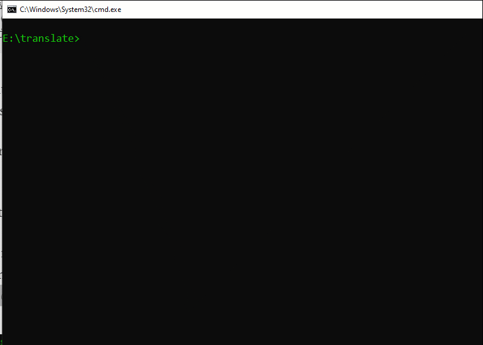

# Simple Language Translation Program

This is simple language translation program built using Python 3.9

For use this code, you can install the module

```
pip install googletrans==3.1.0a0
```

Then just run the python code

```
python simple_translation_program.py
```

### Preview



### Medium

[Article](https://python.plainenglish.io/build-a-simple-language-translation-program-using-python-60b22b492a94)
